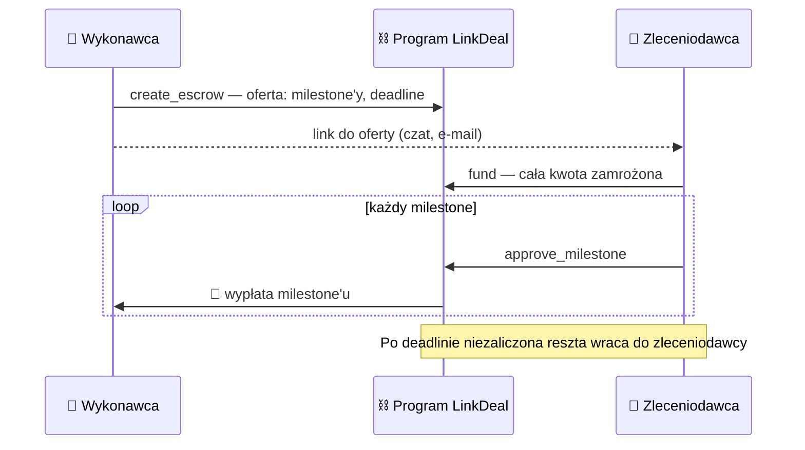

# LinkDeal


**Escrow dla freelancerów na Solanie.** Kwota zlecenia jest zamrożona w programie on-chain i trafia do wykonawcy po zaliczeniu kolejnych milestone'ów. Bez pośrednika i bez arbitra.

*Freelance escrow on Solana: funds locked on-chain, released milestone by milestone. No intermediary.*

🌐 [linkdeal.fun](https://linkdeal.fun) · 📋 [ogloszenia.linkdeal.fun](https://ogloszenia.linkdeal.fun) · ⛓️ [program w Explorerze](https://explorer.solana.com/address/AjavKz4Y4NkvuvxdwAWQ5Wt4BUpJowA6H23PEdV9rd2S?cluster=devnet) · 🦀 [kod programu](programs/linkdeal/src/lib.rs)

Superteam Poland Hackathon · „Finance Without Intermediaries”

## Jak to działa



- ✅ Zaliczony milestone oznacza natychmiastową wypłatę dla wykonawcy.
- ↩️ Niezaliczony do deadline'u oznacza zwrot do zleceniodawcy.
- 🛡️ Wykonawca ryzykuje najwyżej jeden milestone, a zleceniodawca płaci tylko za to, co zaliczył. Nie ma trzeciej drogi, więc nie ma sporów.

## Demo → program

Każdy krok demo to jedna instrukcja w [`lib.rs`](programs/linkdeal/src/lib.rs). Link prowadzi do linii, która to sprawdza.

| Krok w demo | Instrukcja | Program pilnuje, że… |
|---|---|---|
| 1️⃣ „Wyślij ofertę” | [`create_escrow`](programs/linkdeal/src/lib.rs#L13) | jest 1–10 milestone'ów z kwotą > 0 ([L121](programs/linkdeal/src/lib.rs#L121)), a oferta wygasa przed deadlinem ([L21](programs/linkdeal/src/lib.rs#L21)) |
| 2️⃣ „Przyjmij ofertę i zamroź” | [`fund`](programs/linkdeal/src/lib.rs#L41) | oferta jest nieprzyjęta i ważna ([L43](programs/linkdeal/src/lib.rs#L43)); cała kwota trafia na konto umowy ([L50](programs/linkdeal/src/lib.rs#L50)) |
| 3️⃣ „Zalicz milestone” | [`approve_milestone`](programs/linkdeal/src/lib.rs#L67) | podpisuje zleceniodawca z umowy ([L186](programs/linkdeal/src/lib.rs#L186)), przed deadlinem ([L69](programs/linkdeal/src/lib.rs#L69)); kwota idzie do wykonawcy ([L82](programs/linkdeal/src/lib.rs#L82)), a po ostatnim konto się zamyka ([L77](programs/linkdeal/src/lib.rs#L77)) |
| 4️⃣ „Zwróć niewypłaconą kwotę” | [`refund_after_deadline`](programs/linkdeal/src/lib.rs#L102) | deadline minął ([L103](programs/linkdeal/src/lib.rs#L103)); reszta trafia tylko do zleceniodawcy z umowy ([L212](programs/linkdeal/src/lib.rs#L212)) |
| 5️⃣ „Anuluj ofertę” | [`cancel`](programs/linkdeal/src/lib.rs#L90) | oferta wygasła i nikt jej nie przyjął ([L92](programs/linkdeal/src/lib.rs#L92)); kaucja wraca do wykonawcy |

Umowa to konto PDA [`Escrow`](programs/linkdeal/src/lib.rs#L221) (seedy `["escrow", wykonawca, nonce]`), a jego adres jest linkiem do umowy. Pieniądze mogą z niego trafić **tylko** do stron umowy. Autorzy aplikacji nie mają do niego żadnych uprawnień.

## Co gdzie jest

```
programs/linkdeal/src/lib.rs   ⛓️  program on-chain: 5 instrukcji, konto umowy, błędy
tests/linkdeal.ts              🧪 testy integracyjne programu
app/                           🌐 aplikacja umów → linkdeal.fun (statyczna, bez backendu)
  src/pages/new.astro               formularz oferty
  src/pages/contract.astro          strona umowy: stan z blockchaina + akcje
  src/lib/program.ts                połączenie z programem
board/                         📋 ogłoszenia → ogloszenia.linkdeal.fun (Astro + Postgres)
deploy/                        🐳 serwer: docker-compose + Caddy
```

**Ścieżka pieniędzy nie przechodzi przez żaden serwer.** Jedyny backend to ogłoszenia: opis zlecenia i kontakt do autora. Nie trzyma pieniędzy, nie tworzy umów i nie podpisuje transakcji.

## Jak otworzyć projekt

Wymagany jest tylko **Docker**. Wszystkie narzędzia (Anchor, Rust, Node, lokalny blockchain) są w obrazie.

```bash
# 1. środowisko
docker build --platform linux/amd64 --target toolchain -t linkdeal-dev .
docker run -d --name linkdeal --platform linux/amd64 -v "$PWD":/workspaces/LinkDeal \
  -w /workspaces/LinkDeal -p 4321:4321 -p 4322:4322 linkdeal-dev sleep infinity

# 2. program: build + testy na lokalnym blockchainie
docker exec linkdeal bash -lc 'npm install && anchor test'

# 3. aplikacja umów → http://localhost:4321  (najpierw: cp app/.env.example app/.env)
docker exec -it linkdeal bash -lc 'cd app && npm install && npm run dev'
```

Ogłoszenia wymagają jeszcze Postgresa. Konfiguracja jest w [`board/.env.example`](board/.env.example) i [`deploy/docker-compose.yml`](deploy/docker-compose.yml). Do testów w przeglądarce potrzebny jest portfel (np. Phantom) ustawiony na **devnet**.

## FAQ / Uzasadnienie projektowe

| | |
|---|---|
| **Gdzie znika pośrednik?** | Pieniądze trzyma i wypłaca program on-chain, a nie platforma. |
| **Co, jeśli strona zniknie?** | Wykonawca zachowuje to, co dostał. Po deadlinie reszta wraca do zleceniodawcy. |
| **Kto ma jakie uprawnienia?** | Zalicza tylko zleceniodawca. Pieniądze wychodzą tylko do stron umowy. |
| **Czy autor może coś zmienić?** | Po odebraniu upgrade authority (`--final`) już nie. Stan widać w Explorerze. |
| **Dlaczego blockchain, a nie baza?** | Bazie trzeba ufać. Reguł programu nikt nie zmieni, a każdą transakcję widać publicznie. |
